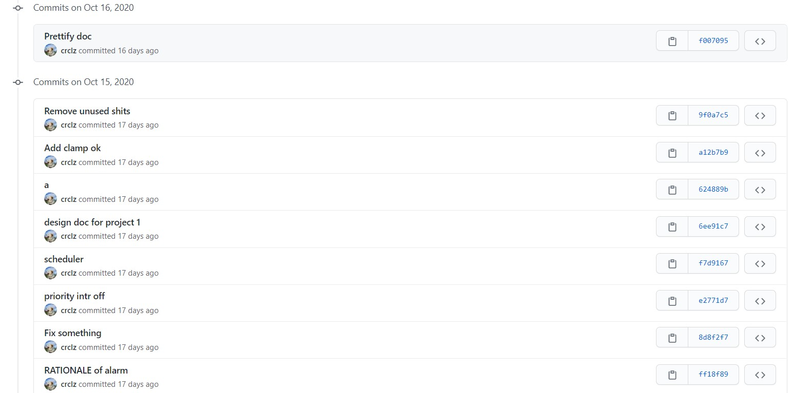
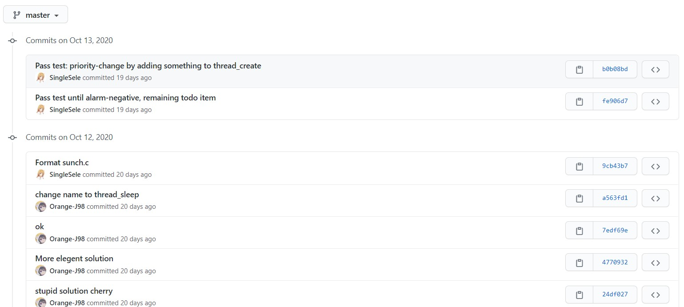

# 07组 PintOS Project 1

## 成员和权重
```
学号      贡献百分比      姓名    邮箱
18373206    25%        陈泓瑞   crucialize@foxmail.com
17376103    25%        刘黄山   920741917@qq.com
17241053    25%        仲诚智   877421603@qq.com
18373485    25%        马骁翀   ma.xiaochong@163.com
```

## GitHub提交记录截图

（按照时间倒序排列）







## 分工情况
ALARM CLOCK: 仲诚智\
PRIORITY SCHEDULING: 马骁翀\
ADVANCED SCHEDULE: 陈泓瑞、刘黄山


## 设计文档

```
            +--------------------+
            |        CS 140      |
            | PROJECT 1: THREADS |
            |   DESIGN DOCUMENT  |
            +--------------------+

---- GROUP ----

>> Fill in the names and email addresses of your group members.

学号        姓名    邮箱
18373206    陈泓瑞  crucialize@foxmail.com
17376103    刘黄山	920741917@qq.com
17241053    仲诚智	877421603@qq.com
18373485    马骁翀	ma.xiaochong@163.com

---- PRELIMINARIES ----

>> If you have any preliminary comments on your submission, notes for the
>> TAs, or extra credit, please give them here.

>> Please cite any offline or online sources you consulted while
>> preparing your submission, other than the Pintos documentation, course
>> text, lecture notes, and course staff.

除了pintos官方文档之外，项目1的完成仅仅参考了这个用于fixed-point小数运算的文件（链接在下方）。
https://github.com/yuwumichcn223/pintos/blob/master/threads/fixed-point.h

除此之外，其余代码全为原创的代码， 并 未 参 考 任 何 解 决 方 案 。


                 ALARM CLOCK
                 ===========

---- 需求分析 ----

首先，拿到项目，发现现有的项目代码提供了:
thread_block 和 thread_unblock 的功能是完整的。
thread_block 会阻塞当前线程，直到 thread_unblock 把当前线程唤醒

所以，思路就是，在 timer_sleep 中，利用 thread_block 让当前线程阻塞，
同时记录睡眠截至的时刻。
同时，应当在合适的时间唤醒该线程。

负责执行 thread_unblock 的函数，肯定是 timer_sleep
另外一定要有一个东西每隔一段时间检测是否有可唤醒的线程，
所以自然想到计时器中断。所以就应当把唤醒的职责分配给这些周期性执行的函数：
timer_interrupt 或 thread_tick 或 schedule。

所以，我们在设计与实现阶段，就应当在 timer_sleep,
timer_interrupt (或 thread_tick, schedule) 上动手脚，


---- DATA STRUCTURES ----

>> A1: Copy here the declaration of each new or changed `struct' or
>> `struct' member, global or static variable, `typedef', or
>> enumeration.  Identify the purpose of each in 25 words or less.

添加到 struct thread 的新成员：

    // 此属性进入睡眠前会被设置，然后在 thread_tick 函数体内会检查此属性看看是否应该被唤醒
    int64_t sleep_until;


static variables:

    // 是一个有序列表，插入的时候必须保证有序（sleep_until升序）。对应元素：thread.elem
    static struct list sleeping_list;


---- ALGORITHMS ----

>> A2: Briefly describe what happens in a call to timer_sleep(),
>> including the effects of the timer interrupt handler.

timer_sleep 会调用 thread_sleep (暂且把timer_sleep当作一个wrapper)
thread_sleep 的功能让当前运行的线程进入睡眠。进行的操作：
1. 计算并修改当前线程的 sleep_until
2. 把当前线程插入（有序插入） sleeping_list
2. 调用 thread_block() 阻塞当前线程，同时 thread_block 也会让 schedule() 去进行调度

线程的唤醒：
计时器中断发生会触发 timer_interrupt，timer_interrupt 会调用 thread_tick
在 thread_tick 中，代码会遍历 sleeping_list ，弹出可以唤醒的线程，并调用 thread_wake。
thread_wake 会进行如下工作：
1. 调用thread_unblock让应当被唤醒的线程停止阻塞
2. 通过调用 intr_yield_on_return 的方式，安排一次 schedule() 的执行。（因为处于外中断上下文）
如果不在当前tick安排schedule的执行，而是等待每TIME_SLICE执行一次的schedule，
也可以实现功能，但是为了保证精确的时效，为了测试的保险，就在当前tick进行调度


>> A3: What steps are taken to minimize the amount of time spent in
>> the timer interrupt handler?

维护了一个 thread_sleep 有序列表，按照sleep_until升序。
在寻找待唤醒的线程的时候，只需要从表头开始遍历，一旦遇到一个尚未到唤醒时刻的线程，就停止遍历。
这样能够最大化地降低计时器中断处理函数的时间复杂度
（相当于把复杂度转嫁给了 timer_sleep 函数）


---- SYNCHRONIZATION ----

>> A4: How are race conditions avoided when multiple threads call
>> timer_sleep() simultaneously?

timer_sleep 会修改 sleeping_list，所以可以想到的思路是在访问之前上锁。
但是，负责唤醒的代码（在外中断上下文中）也会访问 sleeping_list，所以统一使用关闭中断的方式


>> A5: How are race conditions avoided when a timer interrupt occurs
>> during a call to timer_sleep()?

会发生冲突的有全局变量 ticks ，这个是通过调用 timer_ticks 来解决。timer_ticks 会关中断。
还会发生冲突的是 sleeping_list，这个在 上一个回答 (A4) 里有相关的信息（使用关闭中断的方式）。


---- RATIONALE ----

>> A6: Why did you choose this design?  In what ways is it superior to
>> another design you considered?

我还考虑了使用信号量来实现（并且实现了）。
信号量的方式可行，已经通过全部测试，在 "alarm-sema-new" 分支。
线程睡眠前down一个信号量，唤醒者up这个信号量。
并且，pintos 源代码明确说明信号量的 sema_up 操作可以在中断处理上下文调用。

区别：没有特别大的区别，因为底层的原理都是差不多的。
如果不使用信号量，可以站在更低的角度思考问题、编写程序，从而获得更深的理解。
使用信号量也有好处：使用封装好的更高级的同步的功能，开发过程不容易出错。


             PRIORITY SCHEDULING
             ===================

---- 需求分析 ----

先不考虑优先级 donation 的事情。
需求：
1. When a thread is added to the ready list that has a higher priority
  than the currently running thread, the current thread should immediately
yield the processor to the new thread

2. lock, semaphore, or condition variable, 
 the highest priority waiting thread should be awakened first

3. A thread may raise or lower its own priority at any time, but lowering
 its priority such that it no longer has the highest priority must cause 
 it to immediately yield the CPU.

首先第一点需求，我们可以通过找哪些函数对 ready_list 进行了写操作，
来找出应当在哪里添加 yield / yield on return，
发现有 thread_unblock 和 thread_yield
thread_yield 无需修改，因为 thread_yield 会触发调度函数，最高优先级的会被调度
所以按照需求的定义，thread_unblock 就是唯一需要修改的东西。
但是，在往 thread_unblock 里面添加东西后，会发现出问题，并且难以调试。
所以不选择在 thread_unblock 里面添加东西，而是选择在 thread_create 和
同步原语的一些会 unblock 某个线程的函数里面添加 yield/yield on return。


针对第二点需求，通过同步原语的源代码，我们可以置顶要修改什么：
- lock: 通过对lock的源代码的阅读，发现无需更改
- semaphore: 在 sema_up 时需要做一些操作
- cond: cond_signal 需要做一些操作，但 cond_broadcast 不需要

第三点需求：只需要修改 thread_set_priority


再考虑 priority donation.
priority donation 指明了新的优先级的计算方法：
- 输入：原有优先级、锁的等待关系（网）、线程们的状态
- 输出：线程们的优先级
所以，重点就是如何算出这个优先级，以及何时计算。
如何算出优先级？只需要通过锁的等待关系，正确地实现算法，则可以算出优先级。
 此外，如何知道锁的等待关系？这时候就应当维护 thread.locks_holding （下文有介绍）
何时计算？我们决定采用动态计算的方法——要访问优先级的值的时候，才进行计算（下文有说明）


---- DATA STRUCTURES ----

>> B1: Copy here the declaration of each new or changed `struct' or
>> `struct' member, global or static variable, `typedef', or
>> enumeration.  Identify the purpose of each in 25 words or less.

在 struct thread 增加的成员：
    // 该线程拥有的锁的列表。这个对计算donation后的优先级有帮助
    struct list locks_holding;

相应地，在 struct lock 里面增加的成员：
    // 链表元素
    struct list_elem holder_elem;


>> B2: Explain the data structure used to track priority donation.
>> Use ASCII art to diagram a nested donation.  (Alternately, submit a
>> .png file.)

现在有一个线程 thread_one

thread_one.locks_holding 成员用于跟踪该线程拥有的锁。
以下伪代码展示了寻找在等待 thread_one 所拥有的锁的线程的方法。

``python
waiter_list = []

for lock in thread_one.locks_holding:
    for waiter_thread in lock.semaphore.waiters:
        waiter_list.append(waiter_thread)
``

waiter_list 就是等待者的集合。
通过（递归地）计算每个waiter的优先级，可以算出 thread_one 的优先级。
（由于变化因素太多，donation后的优先级不被存储，而是每次访问时计算）


一个 nested donation:

----------------------

              C
       B ---> L1
 A --> L2     

----------------------

最初，B请求C持有的锁L1。后来，A请求B持有的锁L2。
以下是 各种数据结构 的状态

C.locks_holding: [L1]
L1.semaphore.waiters: [B]

B.locks_holding: [L2]
L2.semaphore.waiters: [A]


---- ALGORITHMS ----

>> B3: How do you ensure that the highest priority thread waiting for
>> a lock, semaphore, or condition variable wakes up first?

对于lock：
lock 是由 semaphore 实现的，所以不需要做出单独的修改。

对于 semaphore：
sema_up 的时候，找出最高优先级的 waiter，进行唤醒操作。（原先是表头的waiter）

对于 condition:
condition内部是1个 waiter 对应1个 semaphore
（封装在 一个 semaphore_elem 里面，存储在 condition.waiters里面）
所以，对于 cond_signal ，我们只需要找出 condition.waiters 里面 最高优先级的线程进行唤醒
对于 cond_broadcast ， 因为 cond_broadcast 只是简单的对 cond_signal 的多次调用。
所以 cond_broadcast 不需要做出修改。


>> B4: Describe the sequence of events when a call to lock_acquire()
>> causes a priority donation.  How is nested donation handled?

前提条件： 线程 L 拥有锁。
在 lock_acquire 函数体中，线程 H 调用 sema_down --> thread_block （被阻塞）。
thread_block 又会调用 schedule
(注意，我的代码并不储存donation后的优先级，而是要用这个优先级的时候才进行计算)
所以，这时，schedule 进行计算优先级计算，会发现最高优先级的是 L，那么 L 就会执行


nested donation 的处理：
1. 在B3问题里面，我解释了跟踪等待者的数据结构
2. 以下伪代码详细解释了计算donation后的优先级的方法

``python
def boosted_priority(t: thread):
    max_val = t.priority

    for lock in t.locks_holding:
        for waiter in lock.semaphore.waiters:
            val = boosted_priority(waiter) // 递归！
            max_val = max(max_val, val)

    return max_val;
``


>> B5: Describe the sequence of events when lock_release() is called
>> on a lock that a higher-priority thread is waiting for.

前提条件： 线程 H 拥有锁。
在 lock_acquire 函数体中，线程 L 调用 sema_down --> thread_block （被阻塞）。
thread_block 又会调用 schedule
注意，我的代码并不储存donation后的优先级，而是要用这个优先级的时候才进行计算
所以，这时，schedule 进行计算优先级计算，会发现最高优先级的还是 H，那么 H 就会执行


---- SYNCHRONIZATION ----

>> B6: Describe a potential race in thread_set_priority() and explain
>> how your implementation avoids it.  Can you use a lock to avoid
>> this race?

thread_set_priority 会修改 priority，
而发生在其他线程调用 boosted_priority 会访问 priority.


解决方案：
在读/写priority之前，关中断。读/写操作完成，然后再开中断。


不能用锁，因为 schedule() 会间接调用 boosted_priority 计算优先级
我们假设线程拥有成员：thread.priority_lock，用于同步对priority的访问。
如果 A 在修改优先级的时候获取了 A.priority_lock，此时 A 刚好用完时间片，
schedule() 被执行，切换到更高优先级的线程 B
（更高优先级的 B 之前之所以没运行，是因为在进行 IO ）
线程 B 用完时间片后，schedule() 被执行。
这时，在计算优先级的时候，会无法获取 A.priority_lock, 造成死锁。


---- RATIONALE ----

>> B7: Why did you choose this design?  In what ways is it superior to
>> another design you considered?

我没有存储donation后的优先级，而是每次动态计算。
是因为donation的情形有很多（nested multiple），变化的因素更多。稍微不注意，就会算错。
还因为内核里面的线程数量不会太多，所以计算的复杂度完全可以接受。

这种方法是最好理解的，可维护性是最好的。

如果要优化性能问题，可以增加一个缓存 (or memo) 来优化性能，
还可以通过限制递归层数来限制。
同时，在条件变化（获取锁/等待锁）时，要使相应的缓存失效。


              ADVANCED SCHEDULER
              ==================

---- 需求分析 ----

关于算法，题目已经给的很清楚了，所以重点问题是：某个量何时计算、谁负责计算、计算的顺序。
何时计算、谁负责计算这两个问题是等价的，因为每一个函数都有不同的被调用时机。

对于 load_avg ，它是一个全局量，题目说 when timer_ticks () % TIMER_FREQ == 0 
所以，应当在计时器中断的处理函数内部，或者 thread_tick 计算。

对于 thread.recent_cpu，由于题目说 when timer_ticks () % TIMER_FREQ == 0
所以和 load_avg 是一样的地方计算。
只不过，注意计算顺序，因为 recent_cpu 依赖于 load_avg, 所以先算 load_avg

对于 priority = PRI_MAX - (recent_cpu / 4) - (nice * 2),
由于 recent_cpu 和 nice 都是现取现用的量，所以没有难度。

最后别忘了 recent_cpu 的另外一个变化的来源：
Each time a timer interrupt occurs, 
recent_cpu is incremented by 1 for the running thread only


---- DATA STRUCTURES ----

>> C1: Copy here the declaration of each new or changed `struct' or
>> `struct' member, global or static variable, `typedef', or
>> enumeration.  Identify the purpose of each in 25 words or less.

struct thread 增加的成员：
    int nice;
    int recent_cpu_fp;// fp 代表 fixed-point

static variable:
    static int load_avg_fp;
    

---- ALGORITHMS ----

>> C2: Suppose threads A, B, and C have nice values 0, 1, and 2.  Each
>> has a recent_cpu value of 0.  Fill in the table below showing the
>> scheduling decision and the priority and recent_cpu values for each
>> thread after each given number of timer ticks:

通过数学计算，得出以下表格：
（ 进行计算的脚本: threads/mlfqs-simulate.py ）

timer  recent_cpu    priority   thread
ticks   A   B   C   A   B   C   to run
-----  --  --  --  --  --  --   ------
    0   0   1   2  63  60  58     A
    4   4   1   2  62  60  58     A
    8   8   1   2  61  60  58     A
   12  12   1   2  60  60  58     A
   16  16   1   2  59  60  58     B
   20  16   5   2  59  59  58     B
   24  16   9   2  59  58  58     A
   28  20   9   2  58  58  58     C
   32  20   9   6  58  58  57     B
   36  20  13   6  58  57  57     A


>> C3: Did any ambiguities in the scheduler specification make values
>> in the table uncertain?  If so, what rule did you use to resolve
>> them?  Does this match the behavior of your scheduler?

歧义：当有优先级的时候，什么是round-robin调度？
（因为，去看维基百科，round-robin是建立在没有优先级的基础上讨论的）

例如，时刻 t1，线程X与Y优先级相同，我们选择调度X。

假设在时刻 t2，线程X与Y优先级相同，按照round robin，我们知道该选择Y进行调度。
假设在时刻 t2，我们发现线程 X 和 Z 优先级相同，这时我们应当先调度哪个？
假设在时刻 t2，我们发现线程 Y 和 Z 优先级相同，这时我们应当先调度哪个？

所以，我遵循的规则是：在全局存放一个计数器，然后每次遇到超过2个做高优先级的线程时，
都取第 (计数器 % 个数) 个线程，然后计数器+=1.

这符合我的调度器的规则。

>> C4: How is the way you divided the cost of scheduling between code
>> inside and outside interrupt context likely to affect performance?

我的划分是：
在外中断上下文中，只计算 load_avg 和 每一个线程的 load_avg
其余工作，例如对线程的优先级，我在需要的时候才进行计算。

对于性能的影响：为了性能，应该尽量在外中断上下文里面少进行计算。我的设计符合这一目标。


---- RATIONALE ----

>> C5: Briefly critique your design, pointing out advantages and
>> disadvantages in your design choices.  If you were to have extra
>> time to work on this part of the project, how might you choose to
>> refine or improve your design?

优点：代码可维护性好。缺点：性能可能略微有改进的空间。

如果可以的话，应该使用64个队列来进行调度，可能这种顺序访问结构在简单场景下的效率要高。
如果使用64个队列，效率会得到提升。N次比较 vs 64次比较。
当N很小的时候，两种方法的效率都高。
当N很大时，64个队列会有很明显的优势。

但是，pintos开发手册里面讲了，不要追求最大效率，而是要遵循pintos的代码风格。
list已经提供了很多可用的函数，要充分利用这些函数来实现功能。
所以，我这种实现有利于可维护性。


>> C6: The assignment explains arithmetic for fixed-point math in
>> detail, but it leaves it open to you to implement it.  Why did you
>> decide to implement it the way you did?  If you created an
>> abstraction layer for fixed-point math, that is, an abstract data
>> type and/or a set of functions or macros to manipulate fixed-point
>> numbers, why did you do so?  If not, why not?

我选择使用 宏 来实现它。
an abstract data type：没必要使用一个新的数据结构，直接用int就行了
functions：函数会有栈的开销，对性能会有损耗
综上，我选择宏来实现。


               SURVEY QUESTIONS
               ================

Answering these questions is optional, but it will help us improve the
course in future quarters.  Feel free to tell us anything you
want--these questions are just to spur your thoughts.  You may also
choose to respond anonymously in the course evaluations at the end of
the quarter.

>> In your opinion, was this assignment, or any one of the three problems
>> in it, too easy or too hard?  Did it take too long or too little time?

>> Did you find that working on a particular part of the assignment gave
>> you greater insight into some aspect of OS design?

>> Is there some particular fact or hint we should give students in
>> future quarters to help them solve the problems?  Conversely, did you
>> find any of our guidance to be misleading?

>> Do you have any suggestions for the TAs to more effectively assist
>> students, either for future quarters or the remaining projects?

>> Any other comments?
```


